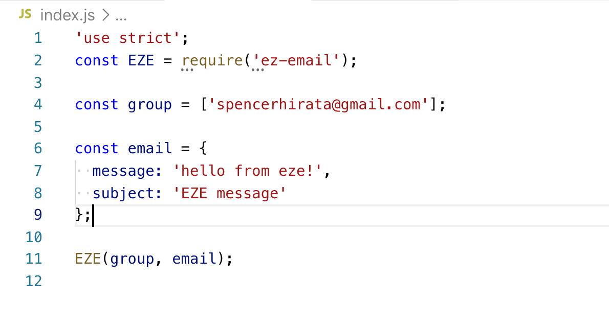
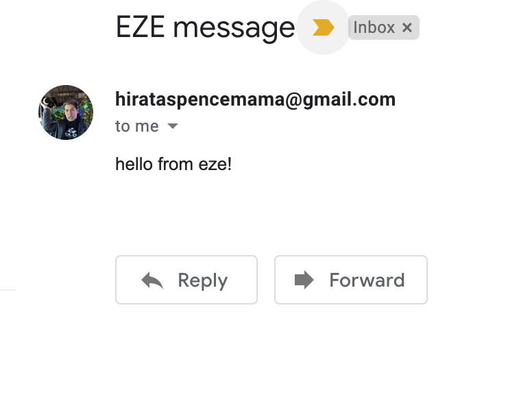
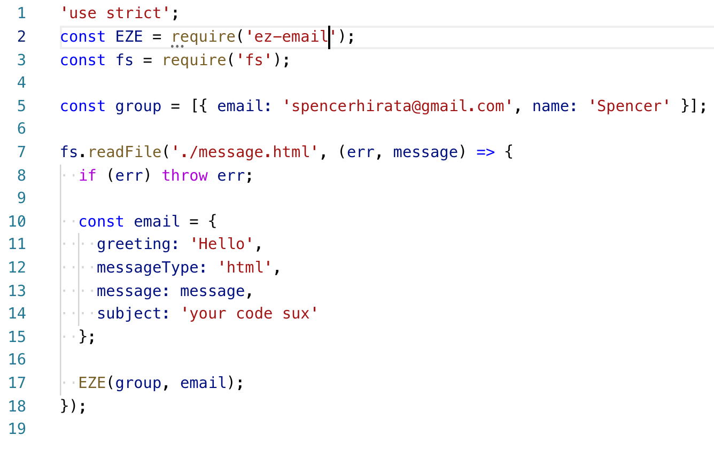

# ez-email

[ez-email](https://www.npmjs.com/package/ez-email) is a fast, easy, basic
emailing package built off of
[nodemailer](https://www.npmjs.com/package/nodemailer)

---

## Getting Started

### NPM Installation:

`npm i ez-email`

### In your javascript file:

```js
const EZE = require('ez-email');
```

### Simple example with ez-email:



### Result:



## Recommended: Use a .env file for email credentials

**ez-email function runs the dotenv method to map out .env variables**

```
EMAIL={your-email-in-raw-text-here}
PASSWORD={your-password-in-raw-text-here}
SERVICE={List is linked below} //Defaulted to gmail
```

### [Service list](`https://nodemailer.com/smtp/well-known/`)

## Gmail users: Disabling "[Less Secure App Access]()"

---

## Function Parameters

```js
EZE(recipients, message, emailCredentials);
```

### **recipients**

Represents the list of recipients you want to send to. Format your array as
such:

```js
const plain = ['someEmail@gmail.com'];
const withoutNames = [{ email: 'someEmail@gmail.com' }];
const withNames = [{ name: 'A dude', email: 'someEmail@gmail.com' }];
```

As you can see, you have the option to have the raw email string or to use an
object. You can tag on other properties to the object if you wish to go that
route, they'll be disregarded when running in the EZE function. The `name`
property is used in the greeting line, which will be talked about in the message
section.

### **message**

This is your message object. Your email properties are defined here.

```js
const maxProperties = {
  greeting: 'Hello',
  subject: 'This is a test',
  messageType: 'html', //The type of markup your message is. Options here are ['html', 'text'] with text as the default
  message: '<h2>We made it!</h2>'
};
const minimalProperties = {
  message: 'Hello' //Technically you don't even need this either, but I doubt you want to be sending emails without messages
};
```

Properties here are pretty self explanatory. Though none of these properties are
actually required to send emails, you wouldn't be sending an email in the first
place if you had no message to the recipient (I hope).

### **emailCredentials**

```js
const emailCredentials = {
  email: 'someEmail@email.com',
  password: 'rawtext',
  service: 'yourserviceproviderhere'
};
```

You might be asking what is the point of this feature if ez-email already parses
your .env file, and the answer to that is if you have multiple emails that
you're sending from. Service defaults to 'gmail' if none is provided. Nodemailer
will give you an error if your credentials aren't correct.

---

## Examples with FS

**With an html template** 
